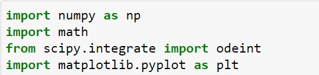
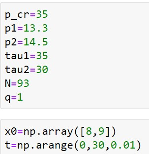
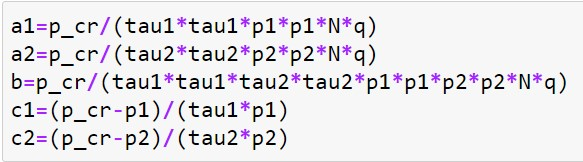
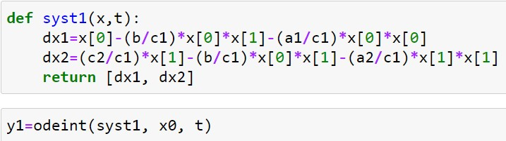
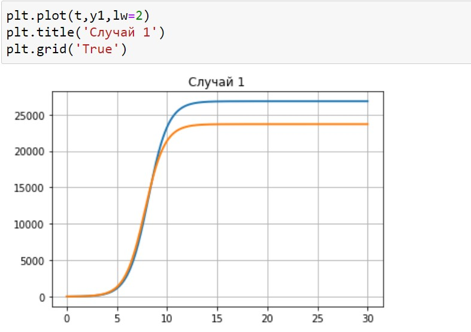
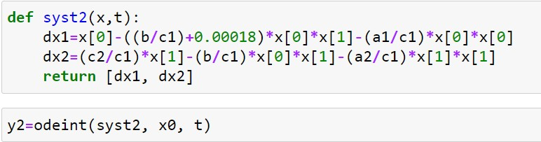
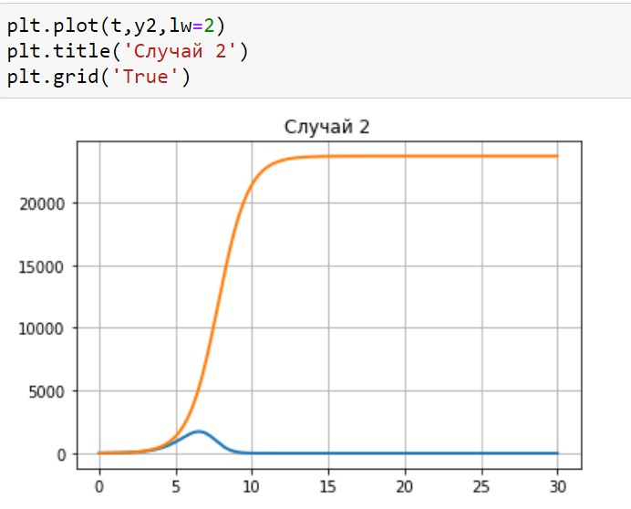

---
## Front matter
title: "Лабораторная работа №8: Модель конкуренции двух фирм"
subtitle: "*дисциплина: Математическое моделирование*"
author: "Голова Варвара Алексеевна"
date: 2021, 02 April

## Formatting
mainfont: PT Serif
romanfont: PT Serif
sansfont: PT Sans
monofont: PT Mono
toc: false
slide_level: 2
theme: metropolis
header-includes:
 - \metroset{progressbar=frametitle,sectionpage=progressbar,numbering=fraction}
 - '\makeatletter'
 - '\beamer@ignorenonframefalse'
 - '\makeatother'
aspectratio: 43
section-titles: true

---

# Цель работы

Ознакомиться с моделью конкуренции двух фирм и построить графики по этой модели.

# Задание

## Задание

Случай 1. Рассмотреть две фирмы, производящие взаимозаменяемые товары одинакового качества и находящиеся в одной рыночной нише. Считать, что в рамках этой модели конкурентная борьба ведётся только рыночными методами. То есть, конкуренты могут влиять на противника путем изменения параметров своего производства: себестоимость, время цикла, но не могут прямо вмешиваться в ситуацию на рынке.

## Задание
Динамика изменения объемов продаж фирмы 1 и фирмы 2 описывается следующей системой уравнений:
$$\frac{dM_1}{d\theta}=M_1-\frac{b}{c_1}M_1M_2-\frac{a_1}{c_1}M_1^2$$
$$\frac{dM_2}{d\theta}=\frac{c_2}{c_1}M_2-\frac{b}{c_1}M_1M_2-\frac{a_2}{c_1}M_2^2$$
где $a_1=\frac{p_{cr}}{\tau_1^2\tilde{p_1}^2Nq}$, $a_2=\frac{p_{cr}}{\tau_2^2\tilde{p_2}^2Nq}$,
$b=\frac{p_{cr}}{\tau_1^2\tilde{p_1}^2\tau_2^2\tilde{p_2}^2Nq}$,
$c_1=\frac{p_{cr}-\tilde{p_1}}{\tau_1\tilde{p_1}}$,
$c_2=\frac{p_{cr}-\tilde{p_2}}{\tau_2\tilde{p_2}}$.

## Задание

Случай 2. Рассмотреть модель, когда, помимо экономического фактора влияния (изменение себестоимости, производственного цикла, использование кредита и т.п.), используются еще и социально-психологические факторы – формирование общественного предпочтения одного товара другому, не зависимо от их качества и цены. В этом случае взаимодействие двух фирм будет зависеть друг от друга, соответственно коэффициент перед $M_1M_2$ будет отличаться.

## Задание

Пусть в рамках рассматриваемой модели динамика изменения объемов продаж фирмы 1 и фирмы 2 описывается следующей системой уравнений:
$$\frac{dM_1}{d\theta}=M_1-(\frac{b}{c_1}+0.00018)M_1M_2-\frac{a_1}{c_1}M_1^2$$
$$\frac{dM_2}{d\theta}=\frac{c_2}{c_1}M_2-\frac{b}{c_1}M_1M_2-\frac{a_2}{c_1}M_2^2$$

Для обоих случаев рассмотреть задачу со следующими начальными условиями и параметрами:
$M_0^1=8, M_0^2=9, p_{cr}=35, N=93, q=1$, $\tau_1=35, \tau_2=30, \tilde{p_1}=13.3, \tilde{p_2}=14.5$.

## Задание

Построить графики изменения оборотных средств фирмы 1 и фирмы 2 без учета постоянных издержек и с веденной нормировкой для случаев 1 и 2.

# Выполнение лабораторной работы

## Библиотеки

Подключаю все необходимые библиотеки(рис. -@fig:001).

{ #fig:001 width=70% }

## Значения

Ввод значений из своего варианта (28 вариант)(рис. -@fig:002).

{ #fig:002 width=70% }

## Переменные

Ввод переменных (рис. -@fig:003).

{ #fig:003 width=70% }

## Случай 1

Решение 1 (рис. -@fig:004).

{ #fig:004 width=70% }

## Вывод графика для случая 1

График изменения оборотных средств фирмы 1 и фирмы 2 (рис. -@fig:005).

{ #fig:005 width=70% }

## Случай 2

Решение 2 (рис. -@fig:006).

{ #fig:006 width=70% }

## Вывод графика для случая 2

График изменения оборотных средств фирмы 1 и фирмы 2 (рис. -@fig:007).

{ #fig:007 width=70% }

# Выводы

Я ознакомилась с моделью конкуренции двух фирм и построила графики по этой модели.
